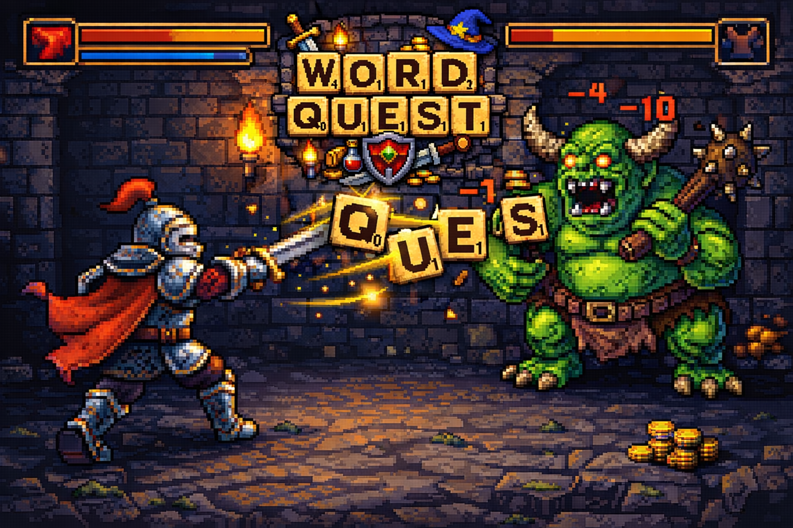
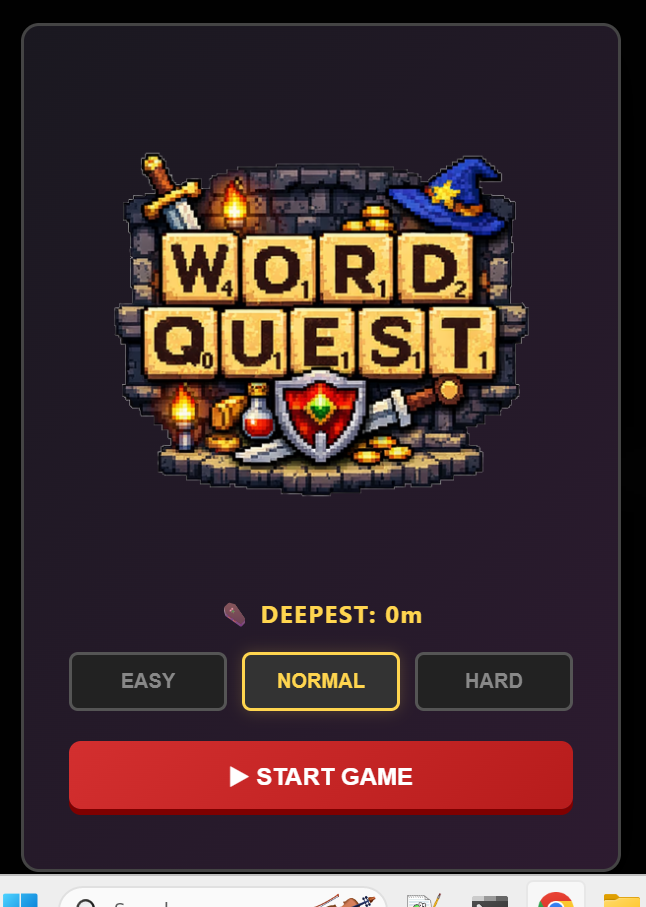
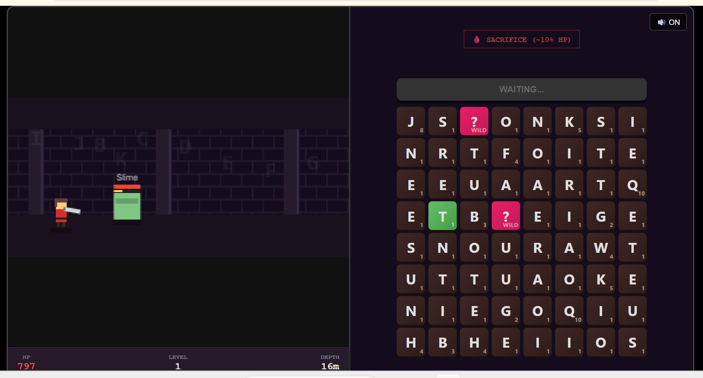

# WORD QUEST

<!-- splarg-storefront:start -->

<p align="center">
  <strong><a href="https://splarg.itch.io/word-quest">▶ Play in browser on itch.io</a></strong>
</p>
<p align="center">
  <a href="https://splarg.itch.io/word-quest">Screenshots & current public release</a> · <a href="https://splarg.com/">splarg.com</a>
</p>
<!-- splarg-storefront:end -->

<!-- splarg-itch-media:start -->
<p align="center">
  <a href="https://splarg.itch.io/word-quest"></a>
</p>
<p align="center">
  
  
</p>
<!-- splarg-itch-media:end -->


A reliability and usability update to the supplied game. The original logo, pixel dungeon, four biomes, boss abilities, difficulty levels, VOID mechanic and endless descent remain.

## Play

Extract **the entire ZIP**, then open `index.html` in a modern browser. Keep `dictionary.js`, `engine.js`, `game.js`, `styles.css`, `wqlogo.png` and `favicon.ico` beside it. The complete word list is included; play does not require a dictionary download. There is no build step and no runtime package installation.

For an existing website, upload those seven files together into the game's folder. Keep a copy of the old deployment first. `index.html` now loads companion files, so replacing only the HTML is not sufficient. Normal static hosting works; server compression is recommended for the dictionary. This package has not been published to your live website.

The downloadable copy works without an internet connection after extraction. A hosted page is not yet an installable/offline-cached PWA: loading the website itself still needs a connection unless the browser has cached its files.

## Controls

- Tap/click letters anywhere on the board, in order. They do not need to touch.
- Type A–Z to choose available tiles. Enter casts. Backspace undoes. Delete clears.
- Esc pauses every fight, including bosses. Space pauses when a button is not focused.
- Keyboard navigation: Tab into the board, move with arrows, select with Space or Enter.
- A green tile changes the word into a heal. A pink wildcard supplies a letter. Red corruption costs health.
- Sacrifice replaces all 64 tiles for 10% of maximum health.
- Pause → **Save & Title** leaves a resumable run. **Continue** restores the board, selection, enemy and curses.

Ordinary words can be prepared while walking and cast when an enemy arrives. Healing words work both while walking and during combat. Full-health healing is blocked so it cannot farm score.

## Saving

Progress saves in this browser approximately every five seconds and after important actions, pausing and leaving the page. Saves include biome crossings and the final crossroads. Switching tabs or losing window focus pauses the game; resuming is deliberate.

There is one saved run per browser origin. Starting a new run replaces it; surrendering, dying or ascending ends it. No account or cross-device syncing is included. Moving to another browser/site address or clearing browser storage can remove access to the save. Browsers may restrict saving when opening local files or using private mode; the menu reports a storage failure and the game remains playable.

The original `void_deepest_descent` record is retained on the same origin. New best records are also separated by difficulty. The old compressed dictionary cache is removed to free storage.

## Files

| File | Purpose |
|---|---|
| `index.html` | Screen structure and menus |
| `styles.css` | Desktop, portrait and landscape layouts |
| `engine.js` | Biomes, audio, dictionary lookup, scoring and letter grid |
| `game.js` | Run lifecycle, input, combat, saves and original canvas renderer |
| `dictionary.js` | Included dictionary: 370,079 words, A–Z, lengths 2–64 |
| `CHANGELOG.md` | Confirmed bugs, fixes and intentional behavior changes |
| `ROADMAP.md` | Proposed next gameplay additions |
| `TESTING.md` | Checks completed and remaining device checks |
| `tests/` | Repeatable regression suite |

## Development checks

Only the development tests need Node.js (20 or later) and npm:

```sh
npm install
npm test
```

The suite uses Happy DOM to execute the actual game code and DOM event handlers. It does not launch a real browser. Drawing calls and audio are stubbed, so these checks do not prove visual layout or sound quality.

## Dictionary credit

The original game used [dwyl/english-words](https://github.com/dwyl/english-words). This update bundles the same project's [words_alpha.txt](https://github.com/dwyl/english-words/blob/master/words_alpha.txt) instead of downloading it during play. Source snapshot retrieved 18 September 2026; uppercased, deduplicated, alphabetically sorted and filtered to A–Z words of 2–64 letters. Its supplied license is reproduced in `DICTIONARY-LICENSE.txt`.

Source SHA-256: `3ed0c94610d8bcf7c11bbb49c56aa49c7234d32b66824df91f554169e572da48`.

This preserves the existing broad dictionary, including obscure words. A smaller curated word list would be a separate gameplay decision.

## License

The Word Quest source code in this repository is released under the MIT License. See [LICENSE](LICENSE).

The bundled dictionary is third-party material and remains covered separately by [DICTIONARY-LICENSE.txt](DICTIONARY-LICENSE.txt).
